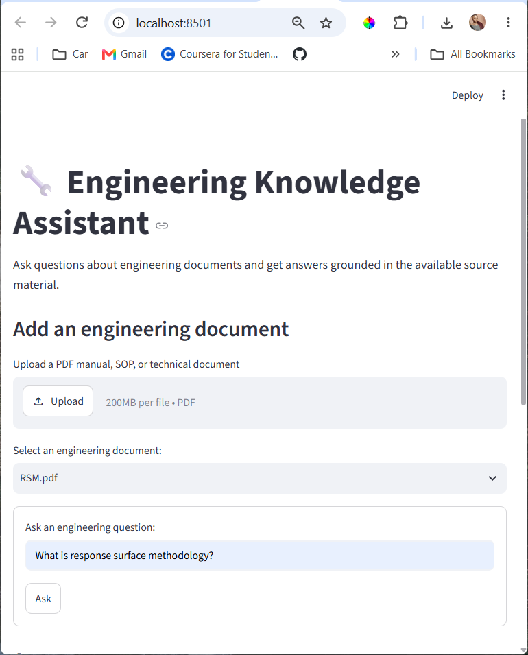
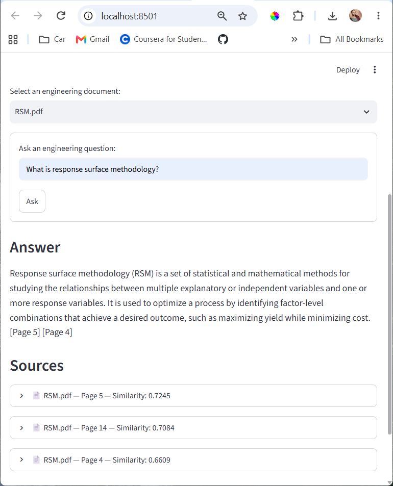

# Engineering Knowledge Assistant





An AI-powered engineering document assistant that uses Retrieval-Augmented Generation (RAG) to answer questions from technical documents.

The system processes engineering PDFs, extracts and chunks their content, stores document metadata and text in SQLite, generates semantic embeddings with OpenAI, and performs vector similarity search using Qdrant. Retrieved document context is then passed to an OpenAI language model to generate grounded answers with page-level source citations.

## Problem

Engineering manuals, Standard Operating Procedures (SOPs), technical reports, and other documentation can contain large amounts of information that are difficult to search manually.

This project provides a natural-language interface for querying technical documents while keeping answers grounded in the information contained in the selected document.

## Key Features

- PDF document ingestion
- Page-aware text extraction
- Text cleaning and chunking
- SQLite document and chunk storage
- OpenAI semantic embeddings
- Local Qdrant vector database
- Semantic similarity retrieval
- Document-level retrieval filtering
- RAG-based answer generation
- Page-level source citations
- Multi-document support
- Retrieval and RAG evaluation tests
- Streamlit web interface

## System Architecture

The application follows a Retrieval-Augmented Generation (RAG) architecture:

```text
                    ┌─────────────────────┐
                    │   Engineering PDF   │
                    └──────────┬──────────┘
                               │
                               ▼
                    ┌─────────────────────┐
                    │    PDF Extraction   │
                    │      PyMuPDF        │
                    └──────────┬──────────┘
                               │
                               ▼
                    ┌─────────────────────┐
                    │    Text Cleaning    │
                    └──────────┬──────────┘
                               │
                               ▼
                    ┌─────────────────────┐
                    │   Text Chunking     │
                    │ Page-aware chunks   │
                    └──────────┬──────────┘
                               │
                 ┌─────────────┴─────────────┐
                 ▼                           ▼
       ┌──────────────────┐        ┌──────────────────┐
       │      SQLite      │        │ OpenAI Embeddings│
       │ Documents/Chunks │        │ text-embedding-3 │
       └──────────────────┘        │      -small      │
                                   └────────┬─────────┘
                                            │
                                            ▼
                                   ┌──────────────────┐
                                   │      Qdrant      │
                                   │ Vector Database  │
                                   └────────┬─────────┘
                                            │
                                            │ Semantic Search
                                            ▼
                                   ┌──────────────────┐
                                   │ Relevant Chunks  │
                                   └────────┬─────────┘
                                            │
                                            ▼
                                   ┌──────────────────┐
                                   │ Context Assembly │
                                   └────────┬─────────┘
                                            │
                                            ▼
                                   ┌──────────────────┐
                                   │   OpenAI LLM     │
                                   │  Grounded Answer │
                                   └────────┬─────────┘
                                            │
                                            ▼
                                   ┌──────────────────┐
                                   │ Streamlit UI     │
                                   │ Answer + Sources │
                                   └──────────────────┘

## Technology Stack

| Technology | Purpose |
|---|---|
| Python | Core application and data processing |
| PyMuPDF | PDF text extraction |
| SQLite | Document and chunk metadata storage |
| OpenAI API | Text embeddings and answer generation |
| Qdrant | Local vector database and semantic search |
| Streamlit | Web application interface |
| python-dotenv | Environment variable management |
| Git & GitHub | Version control and project collaboration |

### AI / RAG Components

- **Embedding model:** `text-embedding-3-small`
- **Vector similarity:** Cosine similarity
- **Vector dimensions:** 1536
- **Vector database:** Qdrant
- **Generation model:** `gpt-5.6-luna`
- **Retrieval strategy:** Top-k semantic similarity search
- **Context control:** Maximum context character limit
- **Source grounding:** Page-level citations
- **Document isolation:** Retrieval can be restricted to a selected document

## Project Structure

```text
Engineering-Knowledge-Assistant/
│
├── app.py
├── main.py
├── index_vectors.py
├── requirements.txt
├── README.md
├── .gitignore
│
├── src/
│   ├── pdf_reader.py
│   ├── text_cleaner.py
│   ├── chunker.py
│   ├── database.py
│   ├── embedding.py
│   ├── vector_database.py
│   ├── rag.py
│   ├── llm.py
│   └── ingestion.py
│
└── tests/
    ├── test_database_transaction.py
    ├── test_retrieval.py
    ├── test_rag.py
    └── test_vector_cleanup.py

## Installation

### Requirements

- Python 3.11 or newer
- Git
- An OpenAI API key

### 1. Clone the repository

```bash
git clone https://github.com/JacklynInc/Engineering-Knowledge-Assistant.git
cd Engineering-Knowledge-Assistant

### 2. Create a virtual environment
On Windows PowerShell:
```powershell
py -m venv .venv
paste **only this**:
```markdown
Activate the virtual environment:
.venv\Scripts\Activate.ps1

### 3. Install dependencies
Install the required Python packages:
python -m pip install -r requirements.txt

### 4. Configure the OpenAI API key
Create a `.env` file in the project root:
```text
OPENAI_API_KEY=your_api_key_here
## Running the Application
Start the Streamlit application:
```powershell
streamlit run app.py

## Using the Assistant
1. Open the Streamlit application in your web browser.
2. Upload an engineering PDF manual, SOP, or technical document.
3. Click **Upload document**.
4. Wait for the document processing to complete.
5. Select the uploaded document from the document selector.
6. Enter an engineering question.
7. Click **Ask**.
8. Review the generated answer.
9. Expand the **Sources** section to inspect the retrieved document excerpts and page numbers.

## Document Processing

When a document is uploaded, it passes through the following ingestion pipeline:

```text
PDF
 ↓
Text Extraction
 ↓
Text Cleaning
 ↓
Text Chunking
 ↓
SQLite Storage
 ↓
OpenAI Embeddings
 ↓
Qdrant Vector Index

## Testing and Evaluation

The project includes automated tests for the main components of the RAG pipeline.

### Test Coverage
- SQLite document and chunk transaction handling
- Vector cleanup operations
- Semantic retrieval
- Document-level retrieval filtering
- Source-aware retrieval evaluation
- RAG answer generation
- Handling of questions that are outside the selected document

### Running the Tests
Run the database transaction test:
```powershell
python -m tests.test_database_transaction
python -m tests.test_retrieval
python -m tests.test_rag
python -m tests.test_vector_cleanup
```

### Evaluation Results

The current test suite successfully validates the core retrieval and RAG behavior.

| Test | Result |
|---|---|
| Database transaction handling | PASS |
| Semantic retrieval | PASS |
| Document-level retrieval filtering | PASS |
| Source-page retrieval | PASS |
| RAG answer generation | PASS |
| Irrelevant question handling | PASS |
| Cross-document question handling | PASS |
| Vector cleanup | PASS |

Example retrieval evaluation results:

- Response Surface Methodology in the relevant document: top similarity score `0.7245`
- Oil well abandonment in the relevant document: top similarity score `0.6771`
- Response Surface Methodology in an unrelated document: top similarity score `0.2354`
- Unrelated general knowledge question: top similarity score `0.0356`

The evaluation demonstrates that the system can distinguish relevant engineering content from unrelated questions within the indexed document collection.

## Engineering Concepts Demonstrated

This project demonstrates practical implementation of several AI engineering and software engineering concepts:

- Retrieval-Augmented Generation (RAG)
- Semantic search
- Vector embeddings
- Vector database design
- Document ingestion pipelines
- PDF text extraction
- Text preprocessing and chunking
- Relational database design with SQLite
- Metadata management
- Document-level retrieval filtering
- Context construction and token/context control
- Grounded LLM generation
- Source attribution
- Error handling and rollback
- Automated evaluation
- Modular Python application design
- Environment variable and API key management
- Git version control
- Streamlit application development

## Challenges and Engineering Decisions

### 1. Document-aware retrieval

A multi-document knowledge base can return semantically similar content from the wrong document.

To address this, the retrieval layer supports filtering results by `document_id`, ensuring that questions are answered using the selected document.

### 2. Source grounding

Semantic similarity alone does not guarantee that retrieved content is appropriate for answer generation.

The RAG pipeline retrieves the corresponding chunk text from SQLite and constructs a controlled context before calling the language model.

The generated response is instructed to use only the supplied context and cite the relevant page numbers.

### 3. Handling unsupported questions

The system should not generate an answer when the selected document does not contain relevant information.

Retrieval therefore uses a similarity threshold. If no relevant chunks meet the threshold, the system returns:

```text
No relevant information was found in the document.

## Future Improvements

Potential improvements for a production deployment include:

- Semantic or section-aware chunking
- Chunk overlap and improved context continuity
- Hybrid keyword and vector retrieval
- Reranking of retrieved chunks
- Improved metadata filtering
- Batch embedding and asynchronous processing
- Support for scanned PDFs using OCR
- Document versioning
- Duplicate document detection using file hashes
- Persistent hosted Qdrant deployment
- Authentication and user access control
- Conversation history
- Streaming LLM responses
- Structured answer generation
- Expanded automated evaluation datasets
- Retrieval precision and recall metrics
- Automated regression testing
- Observability, logging, and performance monitoring
- Deployment using Docker and a cloud platform

## Project Status

**Current status: Functional prototype**

The core end-to-end RAG workflow is implemented and tested:

- PDF ingestion
- Text extraction
- Text cleaning
- Page-aware chunking
- SQLite storage
- OpenAI embeddings
- Qdrant vector indexing
- Semantic retrieval
- Document-level filtering
- Context assembly
- Grounded LLM responses
- Page-level source citations
- Streamlit user interface
- Automated retrieval and RAG evaluation

The current implementation is designed as a portfolio and development project. Production hardening, deployment, observability, authentication, and advanced retrieval techniques remain future improvements.

## License

This project is provided for educational and portfolio purposes.